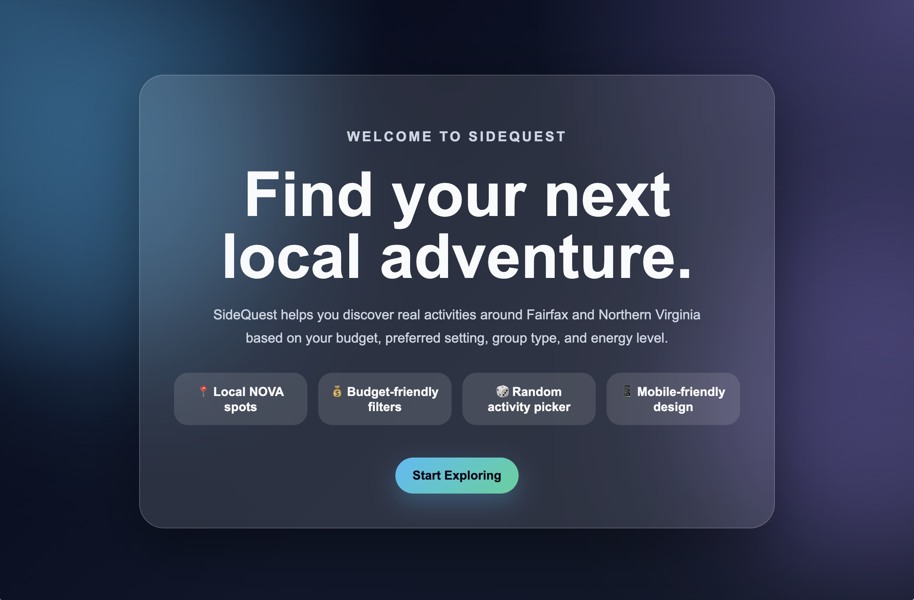
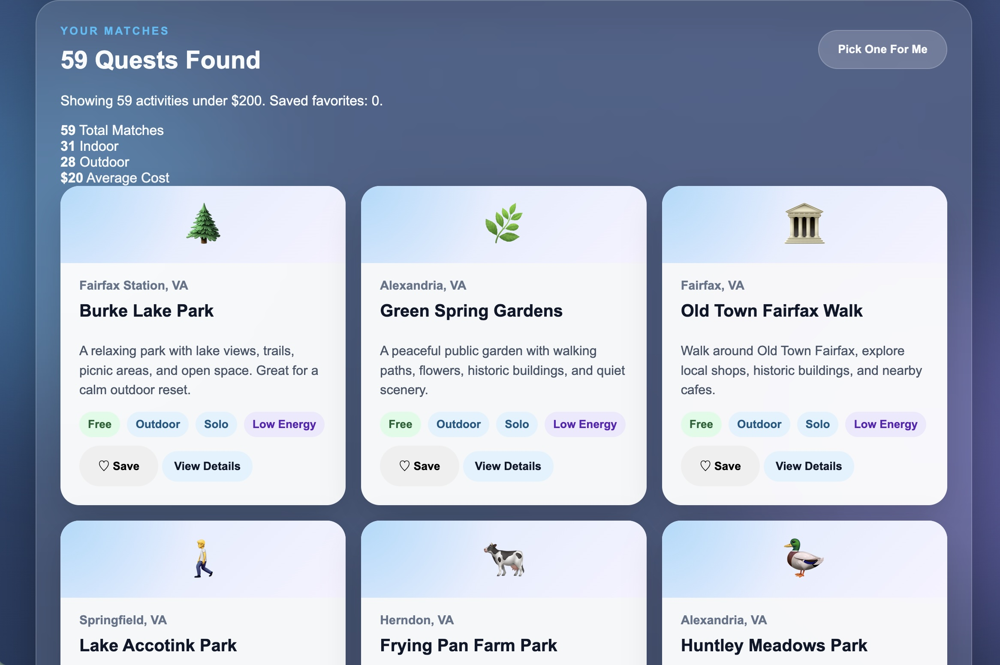
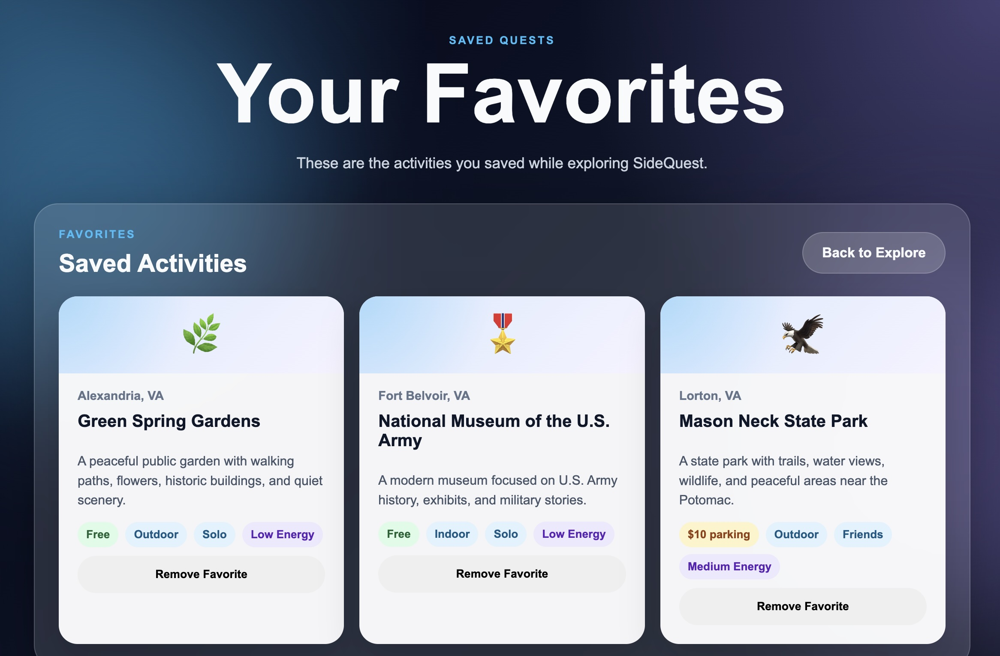

# 🎯 SideQuest

> Discover your next adventure in Northern Virginia.

SideQuest is a web-based activity recommendation application that helps users find local activities based on their budget, preferred setting, group type, energy level, and interests.

---

## 📖 Table of Contents

- [Overview](#-overview)
- [Features](#-features)
- [Screenshots](#-screenshots)
- [Technology Stack](#-technology-stack)
- [Project Structure](#-project-structure)

---

## 🚀 Overview

SideQuest helps users discover real activities around Fairfax and Northern Virginia.

Instead of endlessly searching for something to do, users can quickly receive recommendations based on:

- Budget
- Indoor / Outdoor preferences
- Group type
- Energy level
- Keywords

The application also includes a favorites system, recommendation statistics, detailed activity information, and a random activity generator.

---

## ✨ Features

### 🔎 Smart Recommendations

Filter activities by:

- Budget
- Indoor / Outdoor
- Alone / Friends
- Energy Level
- Search Keywords

### ❤️ Favorites System

- Save activities
- Persistent Local Storage
- Dedicated Favorites Page
- Remove saved activities

### 🎲 Random Activity Generator

Click **Pick One For Me** and SideQuest randomly selects an activity from your results.

### 📊 Recommendation Statistics

SideQuest displays:

- Total Matches
- Indoor Activities
- Outdoor Activities
- Average Cost

### 📍 Real Northern Virginia Locations

Activities include places throughout:

- Fairfax
- Reston
- Arlington
- Alexandria
- Tysons
- Loudoun County

---

## 📸 Screenshots

### Landing Page



### Activity Recommendations



### Favorites Page



---

## 🛠 Technology Stack

| Technology | Purpose |
|------------|---------|
| HTML5 | Page structure |
| CSS3 | Styling and responsive design |
| JavaScript | Recommendation logic and interactivity |
| Local Storage API | Persistent saved favorites |

---

## 📁 Project Structure

```text
SideQuest/
│
├── images/
│   ├── LandingPage.jpg
│   ├── Recommendations.jpg
│   └── FavoritesPage.jpg
│
├── index.html          # Landing page
├── explore.html        # Recommendation engine
├── favorites.html      # Saved activities page
│
├── script.js           # Main application logic
├── favorites.js        # Favorites functionality
├── style.css           # Styling
│
├── recommendation.js
├── recommendation.unit.test.js
├── integration.test.js
├── system.test.js
│
└── README.md
```